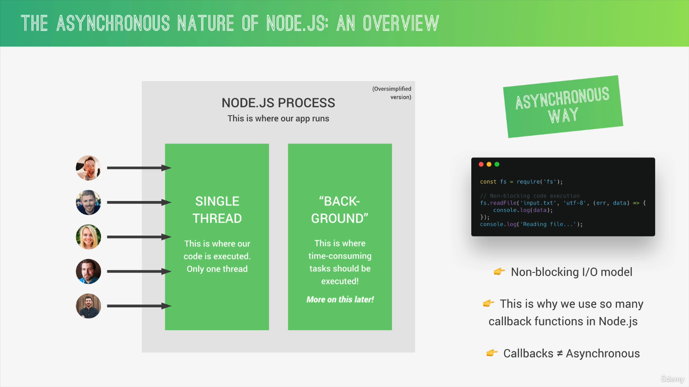
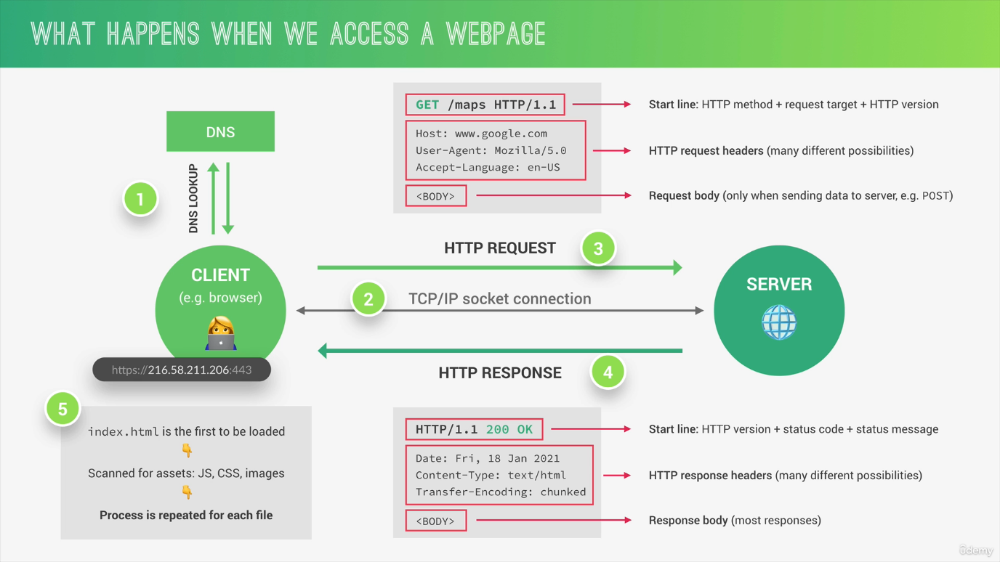

# NodeJS, Express, MongoDB & More 2022

## 1. Course structure


## 2. Intro

### 2.1. What is NodeJS & Why?

> NodeJS is a JavaScript runtime built on Google's open-source V8 Javascript engine

NodeJS just like a conainer, like an environment, in which a program written in JS
can be executed, but outside of any browser whatsoever


### 2.2. Using modules

Read NodeJS docs for modules

```js
const fs = require('fs');

const textIn = fs.readFileSync('text.txt', 'utf-8');
console.log(textIn);

const textOut = 'Text out';
fs.writeFileSync('out.txt', textOut);
```

### 2.3. Blocking and Non-blocking: Asynchronous Nature of NodeJS

- **Synchronous** way: each statement is basically processed one after another, line by line
- **Asynchronous** non-blocking code: we upload heavy work to basically be worked on in the background. And then,
  when that work is done, a callback function that we register before is called to handle the result. And during all
  that time, the rest of the code can still be executing without being blocked by the heavy task, which is now running
  in the background


What problem with blocking code execution in NodeJS?

- In NodeJS process: this is where our NodeJS app runs
- There's only one single thread

  - The thread is just like a set of instructions that is run in the computer's CPU
  - The thread is where our code is actually executed in a machine's processor

NodeJS is basically single-threaded. For each application, there's only one thread.
That's just the way NodeJS was designed.

So in the picture, all users will be executed all in the same thread at the same place in
the computer running the application.

And that is true no matter if you have 5 users, like in this picture, or 5.000 or 5.000.000 users.
Now, what this also means is that when one user locks the single thread with synchronous code, then all
other users will have to wait for that execution to finish.

Synchronous way


Asynchronous way, non-block I/O model. Non-blocking input, output such as reading a file, call an api with request,...


NodeJS uses callback so often



Callback hell


### 2.4. Create a simple web server

```js
const http = require('http');

const server = http.createServer((req, res) => {
  res.end('Hello from the server!');
});

server.listen(8000, '127.0.0.1', () => {
  console.log('Listening to requests on port 8000');
});
```

- `createServer` accepts a callback function, which will be fired off each time
  a new request hits our server.

- `listen` listens for incomming requests from the client

- run the application: `node index.js`

- the app keeps running, that's because of something called the event loop. It is
  obvious that the app cannot really exit right away, because then we could not
  receive any new requests.

- to exit the application, press `Ctrl C`

### 2.5. Routing

Routing basically means implementing different actions for different URLs.

Routing can actually become very very complicated in a big, real world application,
and so in that case we use a tool for that like `Express`

For analyzing the url, we use another module called `url`.

Basic routing bases on some `if-else` statements

```js
const server = http.createServer((req, res) => {
  const pathName = req.url;

  if (pathName === '/' || pathName === '/overview') {
    res.end('This is the overview page');
  } else if (pathName === '/product') {
    res.end('This is the product page');
  } else if (pathName === '/api') {
    res.end('This is the API');
  } else {
    const header = {
      'Content-type': 'text/html',
      'my-own-header': 'Hello World',
    };
    res.writeHead(404, header);

    res.end('<h1>Page not found</h1>');
  }
});
```

### 2.6. Building a very simple API

Web API basically a service from which we can request some data

Let's define a very simple API

In Node, the `dot` in `fs.readFile('./dev-data/data.json')` actually refers to the
directory from which we run the node command in the terminal.

If we move the `index.js` to another place and then executed it. The `.` will point
to the wrong location. So, to fix that, we use the variable called `__dirname`

The best practice is to use the variable `__dirname`

```js
else if (pathName === '/api') {
  res.writeHead(200, { 'Content-type': 'application/json' })
  res.end(jsonData)
}
```

## 3. Node Package Manager (NPM)

- `npm init -y`
- `package.json` a configuration file for our projects

### 3.1. Types of packages and Installs

Types of packages

- Dependencies: package that we will include in our own code. Our project depends our those code to work correctly.
- Development dependencies: package that we will use to develop our applications.

Installs

- Dependencies: `npm install express`
- Development dependencies: `npm install nodemon --save-dev`

Types of installs

- Local: only availabe in our project folder
- Global: availabe anywhere in our machine

To use `command` from local dependencies, we have to specify some `npm script` in `package.json`

```json
"scripts": {
    "start": "nodemon index.js"
}
```

To start the server now, run: `npm run start`

### 3.2. Package versioning and updating

Most packages on npm follows the _Semantic version notation_, which means that
their version numbers is always expressed with these three numbers.

- The first number is called the `major version`: huge new release which can have breaking changes
- The second numer is called the `minor version`: introduces new features into the package, but it does not include breaking changes
- The third number is called the `patch version`: bugs fixed

Updating the package

- Check outdate package: `npm outdated`
- Install package with a certain version number: `npm install slugify@1.0.0`
- Run `npm update <package_name>`
- The `^` means we accept `patch` and `minor` updates
- The `~` means we accept `patch` updates
- The `*` means we accept all of the version updates

## 4. Introduction to Back-end Development

### 4.1. An overview of how the web works?

- What does actually happens each time that we type a URL into our browser in order to
  open up a new webpage?
- Or each time that we request data from some API?

Well, the most simpler answer is that our browser which is also called a client sends
a request to the server where the webpage is hosted. And the server will then send back
a response, which is gonna contain the webpage that we just requested.

This process is called the `request-response model` or also the `client-server architecture`


Structure of an URL: `https://www.google.com/maps`

- Protocol: `HTTP` or `HTTPS` talk later
- Domain name: `www.google.com`
- Resource: `/maps` the resource that we want to access

The domain name is not actually the address of the server, but just the nice name
that is easy for us to memorize.

`DNS` is a way of converting the domain name to the real address of the server.
This happens through your internet service provider (ISP)


And this is how the real IP address looks like: `https://216.58.211.206:443`


- Protocol
- IP Address: `216.58.211.206`
- Port number: `443`, to identify a specific service running on a server and
  so you can think of it like a sub-address

When we have the real web address, a TCP socket connection is established
between the browser and the server, which are now finally connected. And this
connection is typically kept alive for the entire time it takes to transfer all
the files of the website.

- TCP is the Tranmission Control Protocol
- IP is the Internet Protocol

Together, they are communication protocols that define exactly how data
travels across the web.

Then, client makes an `HTTP request`, where `HTTP` stands for `HyperText Transfer Protocol`.
So after `TCP/IP`, `HTTP` is yet another communication protocol. And by the way, the
communication protocol is simply a system of rules that allows two or more
parties to communicate.

`HTTP` is just a protocol that allows clients and web servers to communicate by
sending requests and response messages from client to server and back.

An `HTTP` request to the server is not only for `getting data`, but we can
also `send data`.

An `HTTP` response message also looks quite similar to the request.

This is a single `request-response` cycle


When we do the first request, all we get back is just the initial HTML file.
That file will then gets scanned for all the assets that it needs to build the
entire website like Javascript, CSS files, images files or other assets. And for
each of different files, the browser will then make a new `HTTP request` to the
server.

There can be multiple requests and responses happening at the same time. But the
amount is actually limited because the connection would start to slow down.

And then, when all the files have arrived, the website is rendered in the browser.



Some more words about TPC/IP

- The job of TCP is to break out the requests and responses into thousands of
  small chunks called `packets` before they are sent.
- Then, once they get to their destination, it will reassemble all the packets into
  the original request or response. So that the message arrives at the destination
  as quick as possible, which would not be possible if we sent the website as one
  big chunk.
- The job of IP is to actually send and route all these packets through the internet.
  It ensures that all of them arrive at the destination that they should go using IP
  addresses on each packet.

### 4.2. Frontend vs. Backend Development

In order to distinguish between the frontend and the backend of a website, we still
consider the same client-server architecture

In general terms

- Frontend development is about everything that happens in the web browser.

  - Designing & Building the final website that gonna be visible to the user
  - Basic techs: HTML, CSS, JS
  - Modern tools: React, Angular, Redux, GraphQL,...

- Backend development is about everything that happens on the web server. So everything
  that is invisible to the final user.

- A server is really just a computer that is connected to the internet, which:

  - First, stores a website's files like HTML, CSS and images,...
  - Second, runs an HTTP server that is capable of understanding URLs, requests, and also
    delivering responses.

- A simple web server like the image below is called a static server. Because all is can really
  do is to serve static files to the client via HTTP. If you just need to host a simple website,
  then this is really all you need.


- If you want to create dynamic web applications that talk to databases and all
  that good stuff, we use a server that is also capable of running our dynamic application.
  This is then called a `dynamic server`, where we have our app running, an HTTP server, and
  of course, the files all talking to each other.

- Some usual stuffs that is handled on the backend or the server side are:

  - create user profiles
  - perform login
  - send emails
  - handle payment
  - retrieve and send request data from a database to the client
  - manipulate data in the databse
  - fill up website templates


### 4.3. Static vs Dynamic vs API


## 5. How NodeJS Look behind the scene

### 5.1. Node, V8, Libuv and C++

Node dependencies:

- V8 Javascript engine: understanding Javascript code, convert JS code into machine code
- Libuv: focus on asynchronous IO, this layer give Node access to the underlying computer
  operating system, file system, networking, and more. Besides that, `libuv` also
  implements two extremely important features of NodeJS

  - Event loop: responsible for handling easy tasks like executing call backs and network IO
  - Thread pool: responsible for more heavy work like file access or compressionor something like that

Libuv is completely written in C++ and not in Javascript. And V8 itself, also uses C++
code besides Javascript. So therefore, Node itself is a program written in C++ and Javascript.

The beauty of this is that NodeJS ties all these library together, no matter if written in C++
or Javascript and then gives us developers access to their functions in pure Javascript. So it
really provides us with a very nice layer of abstraction.

So again, this architecture allows us to write 100% pure JS code running in NodeJS
and still access functions like for file reading, which behind the scenes are
actually implemented in `libuv` or other libraries in the `C++` language.

Other libraries that `NodeJS` depends on:

- `http-parser`: parse HTTP
- `c-ares`: DNS requests stuff
- `OpenSSL`: cryptography
- `zlib`: compression


### 5.2. Processes, Threads and the Thread pool

When we use Node on a computer, it means that there is a `Node process` running
on that computer.

The `process` is just a program in `execution`. And we already learned that NodeJS
is basically a C++ program, which will therefore start a process when it's running.
This is important, because in Node, we actually have access to a `process` variable,
which we're gonna use later in this course.

In that `process`, NodeJS runs a so-called `single thread`

The `thread` is basically just a sequence of instructions.

Learn more about Computer Science for `process` and `thread`.

Node runs in just `one thread`, which makes it easy to block Node applications.
And this is one of the unique feature of NodeJS.

So again, if you run your Node application, it'll run in just a single thread.
No matter if you have 10 users or 10 million users accessing your application
at the same time. And so you need to be very careful about not blocking that thread.

Let's now quickly understand exactly what happens in a single thread when you start your
Node application

- Initialze program
- Execute all the `top-level` code or all the code that is not inside any callback function
- Require all the modules that your app needs
- Register all the callbacks
- Start the `event loop`

The `event loop` is where most of the work is done in your app. So, it's really the
heart of the entire Node architecture.

Some tasks are actually too heavy to be executed in the `event loop` because
they would then block the `single thread`. And so, that's where the `thread pool`
comes in.

The `thread pool` is just like `event loop`, which is provided to NodeJS by
the `libuv` library.

The `thread pool` gives us `4 additional threads`, that are completely seperate
from the `main single thread`. And we can actually configure it up to `128 threads`.
But usually, these `4` are enough.

These threads together formed a `thread pool`. The `event loop` can then `automatically`
offload heavy tasks to the thread pool. And all this happens `automatically`
behind the scenes. It's not us developers who decide what goes to `thread pool`
and what doesn't.

The expensive tasks that get offload from the `event loop` are

- All operations dealing with files
- Everything related to cryptography, like hashing password, ...
- All compress stuff
- DNS lookup


### 5.3. The event loop

The first thing that you need to know is that the `event loop` is where all
the application code that is `inside callback` functions is `executed`.

Some parts might get offloaded to the `thread pool`, but it's the `event loop`
that takes care all of this.

`Event loop` really the heart of Node architecture.

NodeJS is build around callback functions. So, functions that are called as sooon
as some work is finished some time in the future.

It works this way because Node uses an `event-triggered` architecture.
What you need to know is that things like our application `receiving an HTTP request`,
`a time expiring`, `a file finished to read`,... All these will emit events as soon
as they are done with their work, and our `event loop` will then `pick up`
these events and call the `callback functions` that are associated with each event.

So again, the event loop receives events each time something important happens,
and will then call the necessary callbacks such as we define in our code.

Summary, the `event loop` does the `orchestration`, which simply means that it
receives events, calls their callback functions, and offloads the more expensive
tasks to the thread pool.


- What happens behind the scenes?
- In what order are these callbacks executed?

So again, when we start the Node application, the `event loop` starts running right away.

The `event loop` has multiple phases, and each phase has a `callback queue` which are
the callbacks coming from the events that the event loop receives.

The `4 most important` phase

- The first phase takes care of callbacks of `expired timers`, for exmple, from the
  `setTimeout()` function. So, if there are callback functions from timers that just
  expired, these are the first ones to be processed by the event loop.
  If the timer expires later during the time when one of the other phases are being
  processed. Then the callback of that timer will only be called as soons as the
  event loop comes back to this first phase. And it works like this in all four phases.
  So callbacks in each queue are processed one by one until there are no ones left in
  the queue, and only then, the event loop will enter the next phase.

- Next up, we have I/O polling and execution of I/O callbacks. Polling basically means
  looking for new I/O events that are ready to be processed and putting them into
  the callback queue. (networking and file access,...), and in this phase, where 99%
  of our code gets executed.

- The next phase is for `setImmediate()` callbacks, this is a special kind of timer
  that we can use if we want to process `callbacks` immediately after the `I/O polling` and
  execution phase. Which can be important in some more advanced use cases.

- The fourth phase is for close callbacks. Basically, in this phase, all close
  events are processed, for example, for when a web server or a websocket shutdown.


There are also two other queues:

- Process.NextTick() queue
- Other microtasks queue: using for `resolved promises`

If there is any callbacks in one of these two queues to be processed, they will
be executed right after the current phase of the event loop finishes instead of waiting
for the entire loop to finish.

So in other words, after each of these four phases, if there are any callbacks in these
two special queues, they will be executed right away.


And with that, we actually finished one `tick` of the `event loop`, and a `tick`
is basically just one `cycle` in this `loop`.

So now this time to decide whether the loop should continue to the next tick or if
the program should exit. And how does Node do that?

Well, it's very simple. Node simply checks whether there are any timers or I/O tasks
that are still running in the background, and if there aren't any, then it will
exit the application. But if there are any pending timers or I/O tasks, then it will
continue running the event loop and go straight to the next tick.

So, for example, when we're listening for incoming HTTP requests, we basically running
an I/O task, and that is why the event loop, and therefore NodeJS keep running and
keep listening for new HTTP requests coming in instead of just exiting the application.


So, in a nutshell, the most important thing is that `event loop` is what makes
`asynchronous` programming possible in NodeJS. It takes care of all incoming events
and performs orchestration by offloading heavier tasks into the `thread pool`,
and doing the most simple work itself.

We need `event loop` because in `NodeJS`, everything works in one `single thread`.


There are some potential solutions to these blocking problems, like manually offloading
to the `thread pool` or using `child processes`.

### 5.4. Events and Event-Driven architecture

Most of Node's core modules like HTTP, File System and Timers are built around
an event-driven architecture. And we can of course use this architecture to our
advantage in our own code.

And the concept is actually quite simple

In Node, there are certain objects called `event emitters` that emit `named events`
as soon as something important hapens in the app, like request hitting server, or
a timer expiring, or a file finishing to read.
These events can then be picked up by `event listeners` that we developers setup, which
will fire off callback functions that are attached to each listener.

So again, one one hand, we have `event emitters`, and on the other hand, we have
`event listeners` that will react to `emitted events` by calling `callback function`


The example show how Node use the event-driven architecture to handle server requests in
the HTTP module.

```js
const server = http.createServer();

server.on('request', (req, res) => {
  console.log('Request received');
  res.end('Request received');
});
```

- `server.on`: create a `listener`
- `request`: name of the `event`

So let's say we have our server running, and a new request is made. The server acts
as an `emitter`, and will automatically emit an event called `request` each time a
request hits the server.

This is called the `Observer Pattern` in Javascript programming in general, and it's
quite a popular pattern with many used cases.


### 5.5. Introduction to Stream

A fundamental concept in NodeJS.

> Streams: Used to process (read and write) data piece by piece (chunks), without
> completing the whole read or write operation, and therefore without keeping all
> the data in memory.

For example, when we read a file using `stream`, we read `part` of the data,
`do something` with it, then `free` our memory, and `repeat` this until the
entire file has been processed.

Or think of `Youtube` or `Netflix`, which are both called streaming companies, because
they stream video using the same principle. So instead of waiting until the entire
video file loads, the processing is done piece by piece or in `chunks`, so you can
start watching even before the entire file has been downloaded.

So the princile here is not just about NodeJS. But universal to computer science in general.


### 5.6. How Requiring Modules Really Works?

In NodeJS module system

- Each JS file is treated as a seperate module
- NodeJS uses the `CommonJS module system`

  - `require()`
  - `exports`
  - `module.exports`

- `ES module system` is used in browsers: `import/export`
- There have been attempts to bring `ES module system` to NodeJS (`.mjs`)


What happens when we `require()` a module?

The following steps are executed behind the scenes:

- First, the path to the required module is resolved and the file is loaded
- A process called `wrapping` happens
- The module code is executed
- The module `exports` are returned
- The entire module gets cached

Detail

How does Node know which file to load when we require a module?

We can actually load `3` kind of modules:

- Core modules: `require('http')`
- Developer modules: `require('./lib/controller')`
- 3rd-party modules (from NPM): `require('express')`

So this process is known as resolving the file path. When the require functions
receives the module name as its input. It will first try to load a `core module`
with that name. It will automatically find a path to that module and then load it.
Now, if the path starts with a `dot`, or two `dots`. It means that it's a developer
module. Because we indicate the relative path to our file. So Node will try to load
that file. But if there is no file with that name, then it will look for a folder instead and
load `index.js` if it's in that folder. In this above example, it will load the `controller.js`
file (we can omit the `.js` extension), if there is no `controller.js` file, it will then
load the `index.js` inside the `controller` folder. And finally, if it's not the `core module`
or the `developer module`, Node will assume it's a module from NPM. So these third party modules
are stored in a `node_modules` folder. So Node will step into that folder and try to find
a module there and then load it.


Moving on, after the module is loaded. The module's code is wrapped into a specific
function which will give us access to a couple of special objects. It is here where
we get the answer to the question: Where does the `require` function actually come from and
why do we have access to it? It's because the NodeJS runtime takes the code off our module
and puts it inside the `immediately invoked function expression` (IIFE).

So Node does actually not directly execute the code that we write into a file. But instead,
the wrapper function that will contain our code in its body. It also passes the `exports`,
`require`, `module`, `__filename`, `__dirname` objects into it. So that why in every module,
we automatically have access to stuff like the `require` function.

Now by doing this, Node achieves two very important things

- Giving developers access to all these variables we just talked about
- It keeps top-level variables that we define in our modules private. So it's scoped only
  to the current module instead of leaking everything into the global object.

So each module having its private scope is absolutely crucial and is achieved
through this clever trick of wrapping our code into this special function.


Next up, the code in the module (or in the module's wrapper function) actually gets
executed by the `NodeJS` runtime.

And then, it's time for the `require` function to actually return something.
And what it returns is the `exports` of the required module. These `exports` are
stored in the `module.exports` object.

`exports` is just a `pointer` to `module.exports`


The last step is that modules are actually cached after the first time they
are loaded. What this means is that if you require the same module multiple times,
you will always get the same result. And the code in the modules is actually
only executed in the first call. In subsequent calls, the result is simply retrieved
from cache.


## 6. Asynchronous

## 7. Express

### 7.1. What is Express?


### 7.2. Installing Postman

A powerful tool to do API testing.
